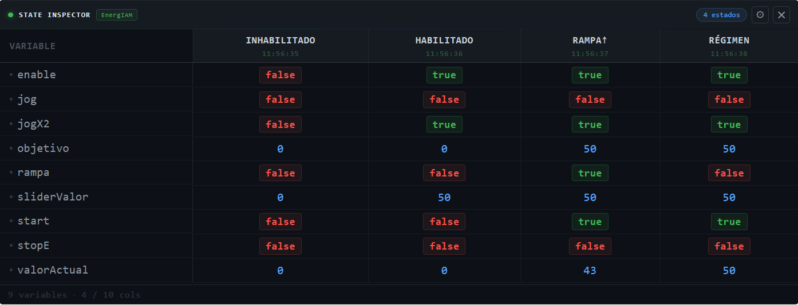

<p align="center">
  
</p>

<h1 align="center">State Inspector</h1>
<h3 align="center">node-red-dashboard-2-state-inspector-energiam</h3>

<p align="center">
  Native <strong>Dashboard 2.0</strong> widget for Node-RED — freeze variable snapshots at different machine states and compare them side-by-side in a live dark-theme table. Built for IIoT state machine debugging.
</p>

<p align="center">
  <a href="https://www.npmjs.com/package/node-red-dashboard-2-state-inspector-energiam">
    
  </a>
  <a href="https://flows.nodered.org/node/node-red-dashboard-2-state-inspector-energiam">
    
  </a>
  
  
  
</p>

<br/>

<p align="center">
  
</p>

<br/>

---

## What it does

Each message adds or updates a **column** in the table. Each key in `valores` becomes a **row**. Send one message per machine state and get an instant side-by-side comparison.

```
Inhabilitado   Habilitado   Rampa↑   Régimen
─────────────────────────────────────────────
enable   false      true      true     true
start    false     false      true     true
rampa    false     false      true    false
valorAct     0         0        43       50
```

Values are **color-coded by type** — no configuration required:

| Type | Color | Style |
|------|-------|-------|
| `true` | `#3fb950` green | bordered badge |
| `false` | `#f85149` red | bordered badge |
| `number` | `#58a6ff` blue | plain |
| `string` | `#e3b341` yellow | plain |
| `null` / `undefined` | `#484f58` grey | dimmed |

New variable keys are **auto-discovered** and added as rows on arrival. Columns accumulate up to the configured maximum, dropping the oldest (FIFO).

---

## Requirements

| Dependency | Version |
|------------|---------|
| Node-RED | ≥ 3.0 |
| @flowfuse/node-red-dashboard | ≥ 1.0 |
| Node.js | ≥ 18 |

---

## Installation

**Via Palette Manager** — search for `node-red-dashboard-2-state-inspector-energiam` in  
**Menu → Manage Palette → Install**.

**Via npm:**
```bash
cd ~/.node-red
npm install node-red-dashboard-2-state-inspector-energiam
# then restart Node-RED
```

---

## Quick start

### 1. Place the node

Drag **state inspector** (category: *EnergIAM*) onto the canvas and assign it a Dashboard 2.0 **group**.

### 2. Send a snapshot

```javascript
// Function node example
msg.payload = {
    nombre: "Habilitado",          // column header
    valores: {
        enable:      true,
        start:       false,
        objetivo:    50,
        valorActual: flow.get("valorActual")
    }
}
return msg
```

Each call to the node with a different `nombre` adds a new column.  
Calling it again with the **same** `nombre` updates that column in-place.

### 3. Reset or remove columns

```javascript
// Clear the whole table
msg.topic = "state-inspector/reset"

// Remove one column by name
msg.topic   = "state-inspector/remove"
msg.payload = { nombre: "Habilitado" }

// Same via payload.action
msg.payload = { action: "reset" }
msg.payload = { action: "remove", nombre: "Habilitado" }
```

---

## Node configuration

| Property | Default | Description |
|----------|---------|-------------|
| **Group** | — | Dashboard 2.0 group *(required)* |
| **Width / Height** | auto | Widget size in grid units |
| **Max columns** | `10` | Oldest column is dropped when the limit is exceeded (FIFO) |
| **Row order** | `arrival` | `arrival` — insertion order · `alpha` — alphabetical |
| **Color true** | `#3fb950` | Badge background for `true` values |
| **Color false** | `#f85149` | Badge background for `false` values |
| **Color number** | `#58a6ff` | Text color for numeric values |
| **Color string** | `#e3b341` | Text color for string values |
| **Color null** | `#484f58` | Text color for null / undefined |

---

## Runtime settings — ⚙ gear panel

Click the **⚙** button in the widget toolbar to open the settings panel. Changes apply instantly and persist in `localStorage`.

| Setting | Options | Default |
|---------|---------|---------|
| Font size | XS (10px) · **S (12px)** · M (14px) · L (16px) | S |
| Row density | Compact · **Normal** · Relaxed | Normal |
| Timestamps | on / **off** | off |
| Sticky variable column | **on** / off | on |

---

## Input message reference

```
Add / update a column
─────────────────────────────────────────────
msg.payload = {
    nombre:  string    // column label (required)
    valores: object    // flat key → value map (required)
}

Control messages
─────────────────────────────────────────────
msg.topic = "state-inspector/reset"           // clear all columns
msg.topic = "state-inspector/remove"          // remove column
msg.payload = { nombre: "ColumnName" }        //   ↑ column to remove

// Equivalent via payload.action:
msg.payload = { action: "reset" }
msg.payload = { action: "remove", nombre: "ColumnName" }
```

---

## Node status indicators

| Indicator | Meaning |
|-----------|---------|
| 🟢 `N estado(s)` | N columns currently in the table |
| ⚫ `sin datos` | Table is empty — waiting for input |
| 🔴 `sin grupo` | No Dashboard 2.0 group assigned |

---

## Example flow

Import [`examples/flows_state_inspector_test.json`](examples/flows_state_inspector_test.json) via **Menu → Import**.

The example simulates a variable-speed drive cycling through four states:  
**Inhabilitado → Habilitado → Rampa↑ → Régimen** — one inject button per state plus a RESET button.

---

## Architecture

This is a **first-class native Dashboard 2.0 widget**, not a `ui-template` workaround.

| Layer | Implementation |
|-------|---------------|
| Backend | Registers via `group.register(node, config, evts)` — same API as built-in widgets |
| Transport | `msg-input:<nodeId>` socket channel (standard Dashboard 2.0 protocol) |
| Frontend | Vue 3 SFC compiled to UMD, loaded by Dashboard from `/resources/` |
| Socket | `inject: ['$socket']` — Dashboard 2.0 provides the socket via Vue DI |
| State | Per-instance Node-RED context (`node.context()`) |
| Styling | CSS injected into UMD bundle — no external stylesheet dependency |

---

## Contributing

Issues and PRs are welcome at  
[github.com/energiamEcoTouch/node-red-dashboard-2-state-inspector-energiam](https://github.com/energiamEcoTouch/node-red-dashboard-2-state-inspector-energiam)

---

## License

**MIT** © 2026 [EnergIAM EcoTouch](https://github.com/energiamEcoTouch)


---

<p align="center">
  Made with ☕ and monospace fonts by <strong>Adrian Iskow</strong>
</p>
